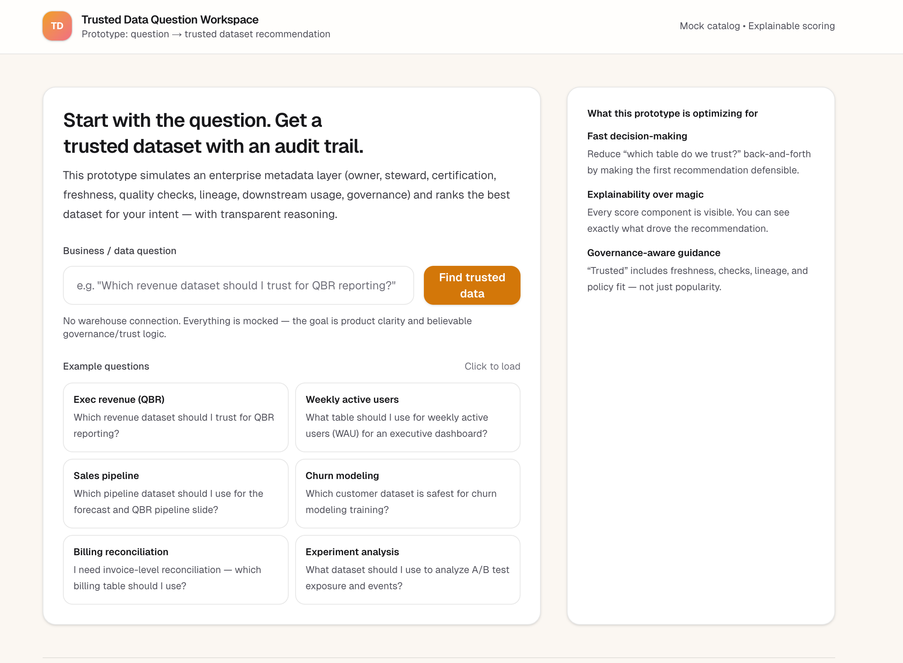
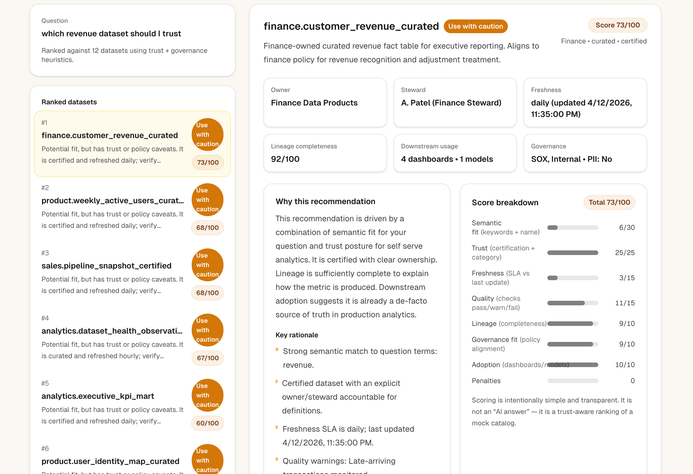
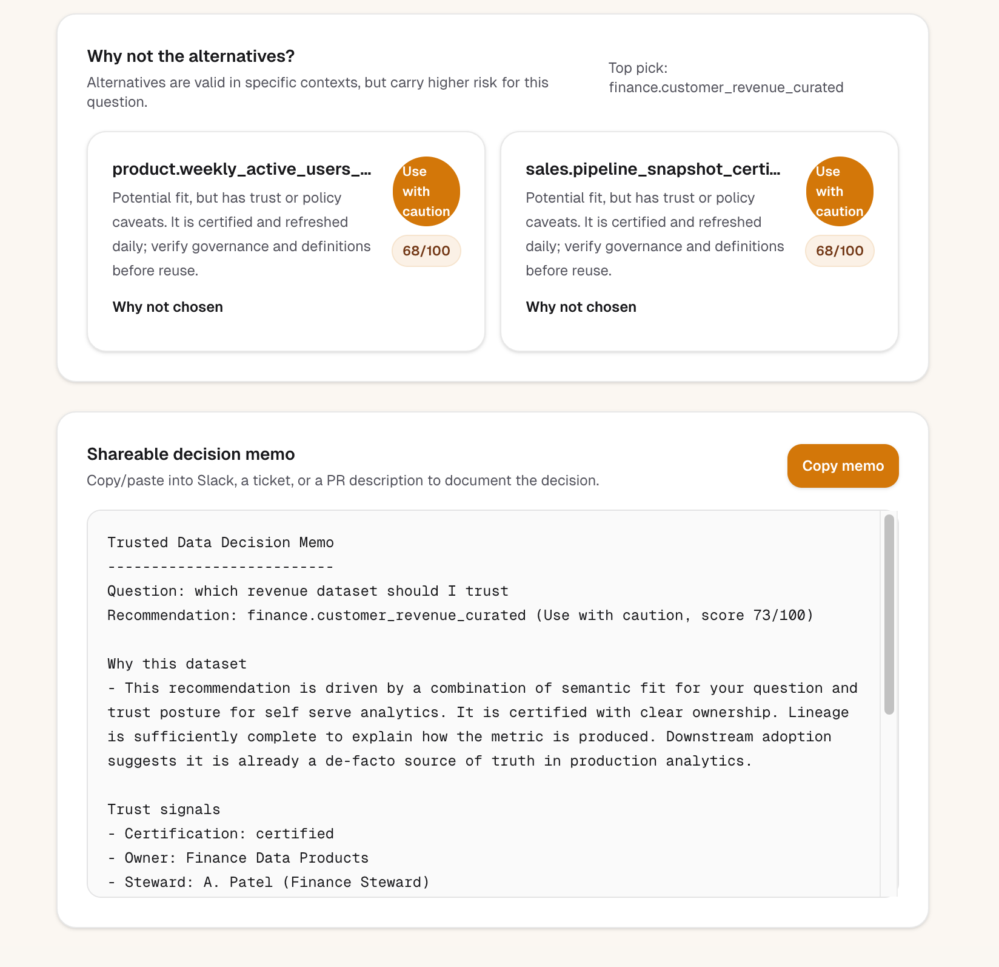

# Trusted Data Question Workspace

An opinionated, lightweight prototype for going from a business question to a trusted dataset decision.

**What it does**: helps an enterprise analyst go from a business/data question to the **most appropriate trusted dataset** — with **transparent reasoning**, **governance-aware caveats**, and a **shareable decision memo**.

This is **not** a generic chatbot and **not** a data catalog clone. It’s a narrow first workflow: *trusted dataset selection*.

## Docs
- **Product brief**: `docs/product-brief.md`
- **Walkthrough script**: `docs/walkthrough.md`

## Target user
- **Primary**: analytics engineers + analysts at mid-to-large enterprises
- **Problem**: “I have a question, but I don’t know which table is safe/official — and I can’t defend the decision quickly.”

## Why this matters
When the “right dataset” isn’t obvious:
- teams ship slower (Slack threads, tribal knowledge)
- metrics diverge (multiple competing sources)
- governance risk increases (PII/policy miss)
- rework increases (dashboards rebuilt after the fact)

## App flow
1. **Landing**: enter a business/data question (with realistic examples).
2. **Results**: top recommendation + 1–2 alternatives with a label:
   - **Recommended**
   - **Use with caution**
   - **Not recommended**
3. **Why this recommendation**: plain-English explanation + auditable scoring.
4. **Trust signals**: certification, owner/steward, freshness, checks, lineage, downstream usage, governance/PII, approved use cases.
5. **Why not alternatives**: explicit tradeoffs so a user can defend the choice.
6. **Decision memo**: copy/paste summary for Slack/tickets/PRs.

## Sample questions (that map cleanly to the seeded catalog)
- “Which revenue dataset should I trust for QBR reporting?”
- “What table should I use for weekly active users (WAU) for an executive dashboard?”
- “Which pipeline dataset should I use for the forecast and QBR pipeline slide?”
- “Which customer dataset is safest for churn modeling training?”
- “I need invoice-level reconciliation — which billing table should I use?”
- “What dataset should I use to analyze A/B test exposure and events?”

## Quick start
1. Start the app.
2. Click an example question (WAU or revenue QBR work well).
3. On results, review:
   - **Why this recommendation**
   - **Score breakdown**
   - **Why not the alternatives**
   - **Decision memo** (copy/paste)

## Decision logic (transparent heuristics)
Recommendations are a **weighted score** over a mocked enterprise metadata layer:
- **Semantic fit**: keyword match against dataset concepts + name
- **Trust posture**: certification + raw-vs-curated bias
- **Freshness**: SLA vs last-updated timestamp
- **Quality**: pass/warn/fail checks
- **Lineage**: completeness score
- **Governance fit**: PII/restricted tags + approved use-case match
- **Adoption**: downstream dashboards/models + popularity proxy
- **Penalties**: stale/uncertified/raw-for-exec/reporting, policy mismatch, etc.

You can see the score breakdown in the UI and the recommendation text is derived from those signals.

## What’s mocked vs real
- **Mocked**:
  - Dataset catalog metadata (seeded in code)
  - Recommendation scoring + “why” generation (heuristics)
  - Governance policy signals and use-case approvals (simulated)
- **Real**:
  - Workflow and information hierarchy
  - Explainability patterns (score breakdown, “why not” comparison, decision memo)
  - Product scope and enterprise trust framing

## Why this concept is useful
This pattern turns metadata into a **repeatable decision workflow**:
- It makes “which dataset should I use?” defensible with explainable trust signals.
- It surfaces governance/PII constraints at decision time (not after a dashboard ships).
- It produces a shareable memo to reduce repeated debates and tribal knowledge.

## What I intentionally did NOT build
To keep the bet narrow and believable:
- No real warehouse / DB integrations
- No authentication / org setup
- No admin UI
- No “chatbot” free-form assistant behavior
- No full catalog browsing or search experience
- No complex backend services

## Project structure
- `src/lib/datasets.ts`: seeded enterprise dataset catalog
- `src/lib/recommend.ts`: transparent scoring + reasoning
- `src/lib/exampleQuestions.ts`: realistic example prompts
- `src/app/page.tsx`: landing question entry
- `src/app/results/*`: recommendation results + memo
- `docs/product-brief.md`: product brief
- `docs/walkthrough.md`: walkthrough script

## Setup
```bash
npm install
npm run dev
```

Open `http://localhost:3000`.

## Screenshots

Three images in `docs/screenshots/`:

| File | What it shows |
|------|----------------|
| `landing.png` | Landing: value prop, question input, example questions |
| `results.png` | Results view: top recommendation (dataset card, trust signals) plus **Why this recommendation** and score breakdown in one scroll |
| `results-memo.png` | **Why not the alternatives?** and **Shareable decision memo** |







## Future iterations (kept intentionally small)
- Configurable weights by team (“exec reporting requires certified sources”)
- First-class “definition diff” for competing datasets
- Real integrations: catalog metadata + lineage + observability signals
- Slack/Jira integration to attach decision memos to work items

